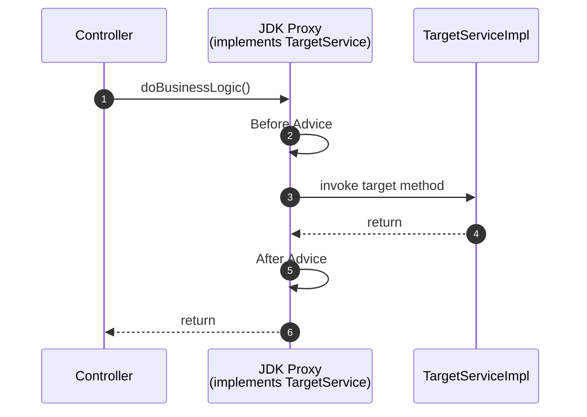
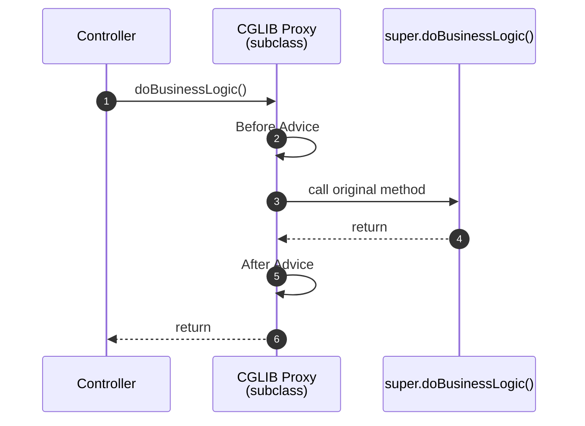

---

# 1️⃣ What is a Spring AOP Proxy?

Spring AOP applies cross-cutting concerns (transactions, caching, logging, security, etc.)
by wrapping a bean in a **proxy object**.

Instead of:

```
Controller → TargetServiceImpl
```

You actually get:

```
Controller → Proxy → TargetServiceImpl
```

The proxy:
1. Executes advice (Before / Around / After)
2. Delegates to the real method
3. Executes post-processing logic

Spring AOP is **proxy-based**, not bytecode weaving (unless using full AspectJ).

---

# 2️⃣ Two Proxy Mechanisms

Spring can create proxies in two ways:

---

## 🔵 A) JDK Dynamic Proxy (Interface-based)

### How it works
- Creates a runtime-generated class
- That class **implements the same interfaces**
- Delegates calls via InvocationHandler-like mechanism
- Does NOT subclass the concrete class

Generated class example:
```
jdk.proxy2.$Proxy12
```

### Core property
Proxy is an implementation of the interface — NOT a subclass of the concrete class.

---

## 🟢 B) CGLIB Proxy (Class-based)

### How it works
- Generates a **subclass** of your concrete class
- Overrides methods
- Inserts advice logic
- Calls `super.method()` internally

Generated class example:
```
TargetServiceImpl$$SpringCGLIB$$0
```

### Core property
Proxy **is a subclass** of your concrete class.

---

# 3️⃣ Architecture Diagrams

---

## 🔵 JDK Proxy Flow



### Key idea:
Proxy implements interface.
No subclassing.

---

## 🟢 CGLIB Proxy Flow



### Key idea:
Proxy overrides method via subclass.

---

# 4️⃣ Core Differences Table

| Feature                       | JDK Proxy            | CGLIB                      |
| ----------------------------- | -------------------- | -------------------------- |
| Requires interface            | ✅ Yes                | ❌ No                       |
| Proxy type                    | Implements interface | Subclass of concrete class |
| Class name example            | `$Proxy12`           | `$$SpringCGLIB$$0`         |
| Injection by concrete class   | ❌ Fails              | ✅ Works                    |
| `instanceof ConcreteClass`    | ❌ false              | ✅ true                     |
| Can proxy final class         | ✅ Yes                | ❌ No                       |
| Can proxy final method        | ✅ Yes                | ❌ No                       |
| Can proxy private method      | ❌ No                 | ❌ No                       |
| Can proxy static method       | ❌ No                 | ❌ No                       |
| Encourages clean architecture | ✅ Yes                | ⚠️ Less strict             |

---

# 5️⃣ Why CGLIB Cannot Proxy Final Methods

CGLIB works by subclassing:

```
class Proxy extends TargetServiceImpl {
   @Override
   public void doBusinessLogic() { ... }
}
```

If method is:

```
public final void doBusinessLogic()
```

Java forbids overriding it → CGLIB cannot intercept.

---

# 6️⃣ Why JDK Proxy Can Intercept Final Implementation Methods

JDK Proxy:
- Does NOT override the class
- Intercepts at interface boundary

Call flow:

```
Controller → Proxy (implements interface)
             → invokes method on target
```

It doesn't override the implementation, so `final` does not block interception.

---

# 7️⃣ Shared Limitation: Self-Invocation (VERY IMPORTANT)

Both proxy types fail here:

```
@Service
class A {

  @Transactional
  public void outer() {
      inner();   // self-invocation
  }

  @Transactional
  public void inner() { }
}
```

Call to `inner()` does NOT go through proxy.
Advice is bypassed.

Fix:
- Move method to another bean
- Or use full AspectJ weaving

---

# 8️⃣ Why Spring Boot Defaults to CGLIB

Boot optimizes for:

1️⃣ Convenience  
2️⃣ Less DI confusion  
3️⃣ Works without interfaces

Example:

```
private TargetServiceImpl service;
```

Works with CGLIB.
Fails with JDK proxy.

Boot chooses predictability for real-world apps.

---

# 9️⃣ When to Prefer JDK Proxies

Use when:

- You want strict "program to interfaces"
- You want to avoid subclassing side effects
- You want architectural clarity
- You care about `final` method interception

Enable:

```yaml
spring:
  aop:
    proxy-target-class: false
```

---

# 🔟 When to Prefer CGLIB

Use when:

- You don’t use interfaces everywhere
- You inject by concrete class
- You want less architectural enforcement
- You prefer convenience

Enable:

```yaml
spring:
  aop:
    proxy-target-class: true
```

---

# 1️⃣1️⃣ How to Detect Which Proxy You Got

```java
System.out.println(bean.getClass());
System.out.println(Arrays.toString(bean.getClass().getInterfaces()));
```

If class contains:
- `$$SpringCGLIB$$` → CGLIB
- `$Proxy` → JDK Proxy

If interfaces include:
- `org.springframework.cglib.proxy.Factory` → CGLIB
- Your business interface + SpringProxy → JDK proxy

---

# 1️⃣2️⃣ Interview-Level Summary

- Spring AOP is proxy-based.
- JDK proxy works via interfaces.
- CGLIB works via subclassing.
- CGLIB cannot override final methods.
- Both fail on self-invocation.
- Boot defaults to CGLIB for convenience.
- You can switch via `spring.aop.proxy-target-class`.

---

# 1️⃣3️⃣ Deep Mental Model (repeat this)

> JDK proxy intercepts at the interface boundary.
>
> CGLIB proxy intercepts by overriding methods in a subclass.
>
> Final blocks overriding.
>
> No proxy sees self-invocation.

---

# 1️⃣4️⃣ One-Line Memory Hook

JDK = Interface wrapper  
CGLIB = Subclass override

---